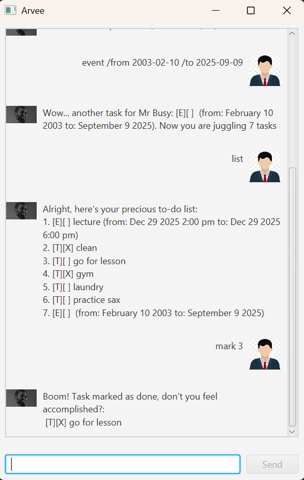

# Arvee Chatbot

Arvee is a simple chatbot application built for managing tasks. It allows you to add, list, delete, mark, find, and sort tasks, with both CLI and GUI support (JavaFX).

## Features

- Add tasks (todo, deadline, event)
- List all tasks
- Mark and unmark tasks as done
- Delete tasks
- Find tasks by keyword
- Sort tasks chronologically (ascending/descending)
- Interactive GUI with JavaFX
- Data persistence with file storage

--- 

## Getting Started

### Prerequisites
- **Java 17 or later** must be installed.  
- **Gradle** is recommended for building and running.

--- 

### Installation
Clone the repository:
```bash
git clone https://github.com/YOUR_USERNAME/ip.git
cd ip
```

Build the project with Gradle:
```bash
./gradlew build
```

Run the chatbot:
```bash
./gradlew run
```

Or run using the JAR file:
```bash
java -jar arvee.jar
```
---

## User Guide

### Adding a Task
- **Todo**
  ```text
  todo read book
  ```
- **Deadline**
  ```text
  deadline submit report /by 2025-09-21
  ```
- **Event**
  ```text
  event project meeting /at 2025-09-25 14:00
  ```

### Listing Tasks
```text
list
```

### Marking and Unmarking
```text
mark 2
unmark 2
```

### Deleting a Task
```text
delete 3
```

### Finding Tasks
```text
find book
```

### Sorting Tasks
```text
sort asc
sort desc
```

### Exiting
```text
bye
```
---
### Command Summary

| Command      | Format                                        |
|--------------|-----------------------------------------------|
| **Todo**     | `todo DESCRIPTION`                            |
| **Deadline** | `deadline DESCRIPTION /by YYYY-MM-DD [HH:MM]` |
| **Event**    | `event DESCRIPTION /at YYYY-MM-DD HH:MM`      |
| **List**     | `list`                                        |
| **Mark**     | `mark INDEX`                                  |
| **Unmark**   | `unmark INDEX`                                |
| **Delete**   | `delete INDEX`                                |
| **Find**     | `find KEYWORD`                                |
| **Sort**     | `sort asc` or `sort desc`                     |
| **Exit**     | `bye`                                         |
---
## Screenshots

Here’s a preview of Arvee’s GUI:



---
## Development

This project uses:
- Java 17
- JavaFX
- Gradle
- JUnit 5

